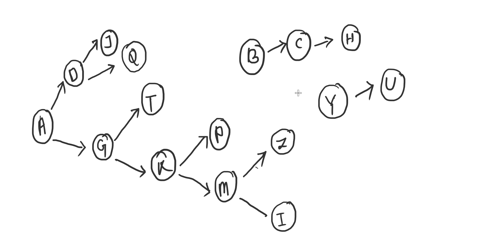
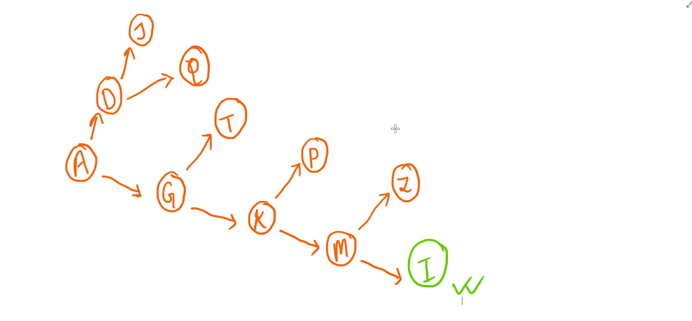

# Relational vs Graph DB

**Relational DB:**
- Data is stored in tables with rows and columns.
- Relationships between data are defined using foreign keys.

**Graph DB:**
- Data is represented as nodes (entities) and edges (relationships).
- Relationships are first-class citizens, directly stored in the database.

To understand the differences we will create a relation for user and its friends and we will find out a user comes under another user's firend-zone(direct or indirect) or not.

So let's make a table for user and its friends in relatainal db.

|User_name|user_friend|
|-|-|
|A|D|
|A|G|
|B|C|
|C|H|
|D|J|
|G|T|
|G|K|
|M|Z|
|Y|U|
|D|Q|
|K|P|
|K|M|
|M|I|
> 📒 just to make it easy here we are using user_name as the primary key of the table instead of number IDs.

❓ **Now we want to find out `I` comes under `A`'s friend zone or not. (Can be direct or indirect).**

😃 Here in a single query we can find direct friends of any user, 
```sql
Select user_friend from USER where user_name = 'A'
```
But to findout indirect friends also we need to do multiple queries.
>⚠️ Even though lot of relational DBs support recursion, with that these kind of queries we can make it in a single queries, but if we talk about the `time_complexity`, that is going to be almost the same(Ignoring the multi query network throughput time).

📒 To solve this problem we will use a set for visited users and a queue to store the users whose friends are not visited yet.

So everytime we will make these processes untill the queue becomes empty.
- We will poll the first user from the queue.
- Get all its friends, add each friend in the queue if they are not already visited.
- Add the user in the set to make that user as visited.

`So initially our set and queue will look like` 
Set = []
queue = [A] (because we are going to start with `A`)

😃 **Let's begin**
1. After polling the first user we will get `A`.
    - get all the friends of `A`
        ```sql
        select user_friend from USER where user_name = 'A'
        ```
    - I will get [D,G]
    - PUT all into the queue cause none of them are visited yet.
    - Make `A` as visited.
    - 📝 Now our set and queue will look like
        ```
        set = [A]
        queue = [D,G]
        ```

2. Now we will poll `D` from the queue and do the same process for `D` as above.
    - `D` friends are [J,Q]
    - 📝 At the end our set and queue will look like
        ```
        set = [A,D]
        queue = [G,J,Q]
        ```
        > 💡 Keep on USER checking the table data for better understanding.
3. Now we will poll `G` from the queue.
    - 📝 At the end our set and queue will look like
        ```
        set = [A,D,G]
        queue = [J,Q,T,K]
        ```
4. Now we will poll `J` from the queue. (`J` does not have any new friend which is not visited yet.)
    - 📝 At the end our set and queue will look like
        ```
        set = [A,D,G,J]
        queue = [Q,T,K]
        ```
5. Now we will poll `Q` from the queue.
    - 📝 At the end our set and queue will look like
        ```
        set = [A,D,G,J,Q]
        queue = [T,K]
        ```
6. Now we will poll `T` from the queue.
    - 📝 At the end our set and queue will look like
        ```
        set = [A,D,G,J,Q,T]
        queue = [K]
        ```
7. Now we will poll `K` from the queue.
    - 📝 At the end our set and queue will look like
        ```
        set = [A,D,G,J,Q,T,K]
        queue = [P,M]
        ```
8. Now we will poll `P` from the queue.
    - 📝 At the end our set and queue will look like
        ```
        set = [A,D,G,J,Q,T,K,P]
        queue = [M]
        ```
9. Now we will poll `M` from the queue.
    - 📝 At the end our set and queue will look like
        ```
        set = [A,D,G,J,Q,T,K,P,M]
        queue = [I]
        ```
10. 🚀 Now in the next poll of the queue we can find `I`. 
Hurrah! So that means `I` is in `A`'s friend zone, and 
we have found it.

🤔 _**But wait a second, even though we have found the answer, what was the cost to find it?**_

1. 📙 To search an element in a relational database which has n records the complexity will be `n`.
> ⚠️ If the key by which we are querying is primary key in that case the complexity will be `log(n)`. but for our simplicity we can assume it is `n`.
2. 📒 We have searched total `9` times and in the worst case it can be `n` times, so complexity will become `n^2` (or better to say `nlog(n)` for primary key query).
3. 📚 Now suppose we have 500k rows in that case the complexity will become `25*10^10`. Now that is a pretty big number and not acceptable for most of the use cases.

#### Now for Graph database
📙 Here we store the data in nodes and make relation with edges.
- The above data will look like -



Here if we start with `A` then we can get the entire friend zone in a single traverse.



➡️ Here also we followed the same BFS technique but in Graph DBs we can get the friends in a constant complexity since they are directly connected to it, compare to relational database where it takes `n` complexity for each user.

**⏳⏳ So to solve the problem**
- Relation DBs can take `n^2 or nlogn` complexity.
- For graph DBs it will take `n` complexity, (Just to visit all users in the friend-zone).

✏️ **Examples of Graph DBs:** Neo4j, Amazon Neptune, ArangoDB, TigerGraph.

📒 One query example for Neo4j for finding a user comes under another user's friend-zone or not,
```sql
MATCH (u1:User {name: "Alice"})-[:FRIEND*1..]->(u2:User {name: "Bob"})
RETURN u1.name AS StartUser, u2.name AS TargetUser, true AS IsInFriendZone
LIMIT 1
```

**🤔 When to Use Which?**
- In most of the cases we should use relational DBs where data is structured,
- But if your data is highly connected and you need to traverse relationships quickly or relationships are complex and central to your application's functionality, then we should use a Graph DB.
